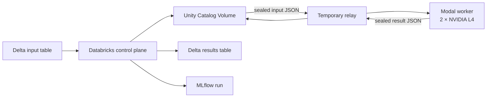

# ShardServe

[](https://github.com/zeeshan8281/shardserve/actions/workflows/ci.yml)
[](LICENSE)

Custom tensor-parallel inference for `Qwen/Qwen2.5-3B-Instruct`, with continuous batching, paged KV storage, a private HTTP API, and a durable Databricks batch data plane.

The hosted path uses Databricks for durable inputs, Delta results, Unity Catalog artifacts, and MLflow tracking. Modal runs the custom inference engine on two NVIDIA L4 GPUs. The relay only handles small temporary JSON shards, so model weights never need to live on the local machine.

The proposed next research milestone is [retrieval-aware tensor-parallel inference with Databricks and Elastic](docs/project-direction.md). It is documented as a proposal until its correctness and performance gates have measured evidence.

The first deployable slice adds an Elastic-backed `/answer` endpoint and a two-L4 Modal web service. See the [deployment runbook](docs/deploy.md).

## What works

- Custom Qwen forward pass with TP1 and TP2; no Hugging Face `generate()`, vLLM, or managed model endpoint.
- Coordinated continuous batching, chunked prefill, paged KV allocation, greedy sampling, cancellation, deadlines, and bounded backpressure.
- NCCL collectives, a Triton paged-attention kernel, and optional CUDA Graphs.
- Immutable input/output shards with checksums, bounded retries, insert-only Delta commits, and MLflow artifacts.
- Full-model BF16 correctness, failure handling, and graph checks executed on two Modal L4 GPUs.
- End-to-end Databricks → Modal → Databricks acceptance with four distinct completed results.

Performance benchmarking is implemented but the full comparison matrix has not been published.

## Architecture



| Component | Responsibility |
|---|---|
| Databricks | Snapshot inputs, persist run state, validate outputs, commit Delta results, record MLflow runs |
| Modal | Cache the pinned model remotely and run the two-GPU custom engine |
| Relay | Move sealed JSON shards between the two services using a temporary local directory |

## Quick local check

Python 3.9 or newer is required. These commands run CPU tests and do not download model weights:

```bash
git clone https://github.com/zeeshan8281/shardserve.git
cd shardserve
python3 -m venv .venv
source .venv/bin/activate
python -m pip install -e .
python -m shardserve check --output artifacts/cpu-tests.txt
```

The test suite covers tensor-parallel algebra, scheduler and KV-cache boundaries, API behavior, durable recovery, and Databricks adapter validation. GPU acceptance is skipped unless two CUDA devices and `SHARDSERVE_MODEL` are available.

## Hosted data plane

Authenticate both CLIs once:

```bash
databricks auth login --host https://YOUR-WORKSPACE.cloud.databricks.com --profile shardserve
modal token new

databricks auth profiles
modal token info
```

The current workspace deployment uses:

- Databricks job: `655087961621636`
- Inputs: `workspace.shardserve.inputs`
- Results: `workspace.shardserve.results`
- Artifacts: `/Volumes/workspace/shardserve/artifacts/runs`
- MLflow experiment: `/Shared/ShardServe`
- GPU worker: two Modal L4 GPUs with the model cached in the `shardserve-models` Modal Volume

Input rows have this schema:

| Column | Type | Meaning |
|---|---|---|
| `request_id` | `STRING` | Unique stable request ID |
| `token_ids` | `ARRAY<INT>` | Prompt already encoded with the pinned tokenizer |
| `max_new_tokens` | `INT` | Maximum generated tokens |

Run the Databricks job with `operation=prepare`. Copy the returned run directory into:

```bash
python3 deploy/databricks/relay.py \
  /Volumes/workspace/shardserve/artifacts/runs/RUN_ID \
  --job-id 655087961621636 \
  --profile shardserve
```

The relay downloads the immutable snapshot, starts the Modal worker, uploads the sealed results, then asks Databricks to commit, validate, and track the run. Its temporary local directory is deleted automatically. Deployment files live in [`deploy/databricks`](deploy/databricks) and [`deploy/modal`](deploy/modal); the full protocol is documented in [`docs/databricks.md`](docs/databricks.md).

## Run the private API

On an authorized CUDA Linux host:

```bash
python -m pip install -e '.[cuda]'
python -m shardserve fetch-model --cache models

python -m shardserve serve \
  --model models/models--Qwen--Qwen2.5-3B-Instruct/snapshots/14d7620ba47cf51be0b176e14e27e38a34d4ff88 \
  --world-size 2 \
  --port 8080
```

Use the exact snapshot path printed by `fetch-model`. The default server binds to loopback:

```bash
curl http://127.0.0.1:8080/health

curl -N http://127.0.0.1:8080/stream \
  -H 'Content-Type: application/json' \
  -d '{"request_id":"example-1","prompt":"Explain tensor parallelism briefly.","max_new_tokens":32}'
```

With Elastic configured, start the same server with `--elastic` and ask a cited question:

```bash
python -m shardserve ask \
  --url http://127.0.0.1:8080 \
  --repository shardserve \
  --question 'Where is KV capacity reserved?' \
  --debug
```

`POST /generate` returns one terminal result. `POST /stream` emits ordered token events followed by one terminal event. `DELETE /requests/ID` requests cancellation at an iteration boundary. Binding beyond loopback requires `SHARDSERVE_API_TOKEN`; clients then send `Authorization: Bearer TOKEN`.

## Model and runtime

The model revision is pinned to `14d7620ba47cf51be0b176e14e27e38a34d4ff88`. Files are checksummed before startup. Runtime defaults are BF16, context length 4096, at most eight live requests, and two tensor-parallel ranks. The model uses greedy argmax generation with prefix reuse disabled.

Only TP1 and TP2 are supported on one node. A two-rank preflight is available before loading weights:

```bash
python -m torch.distributed.run --standalone --nproc_per_node=2 \
  -m shardserve.preflight --output artifacts/gpu-preflight.json
```

## Verification

| Area | Result | Evidence |
|---|---|---|
| CPU and control paths | Passing in GitHub Actions | [`evidence/cpu-tests.txt`](evidence/cpu-tests.txt) |
| TP1/TP2 full-model correctness | Passed on two NVIDIA L4 GPUs | [`evidence/gpu`](evidence/gpu) |
| Graphs and injected rank failures | Passed on two NVIDIA L4 GPUs | [`evidence/gpu/gpu-graphs.json`](evidence/gpu/gpu-graphs.json), [`evidence/gpu/gpu-faults.json`](evidence/gpu/gpu-faults.json) |
| Databricks/Modal data plane | 4 inputs, 4 distinct completed results | [`evidence/databricks/data-plane-finalize.json`](evidence/databricks/data-plane-finalize.json), [`evidence/databricks/data-plane-sql-verification.json`](evidence/databricks/data-plane-sql-verification.json) |
| MLflow upload | Passed | [`evidence/databricks/data-plane-tracking.json`](evidence/databricks/data-plane-tracking.json) |

The connected Databricks Free Edition workspace cannot create classic compute, and its serverless A10 request exhausted the available GPU quota. Modal therefore supplies the GPUs while Databricks remains the data plane. See [`docs/implementation.md`](docs/implementation.md) for design decisions, provenance, and remaining acceptance work.

## Repository layout

```text
shardserve/          inference engine, scheduler, API, batch protocol
deploy/databricks/   serverless control-plane notebook, job, relay
deploy/modal/        two-L4 worker
tests/               CPU and GPU-gated checks
evidence/            compact hardware and acceptance records
docs/                implementation notes and Databricks protocol
```

## Development

Run the checks before opening a change:

```bash
python -m unittest discover -s tests
python -m py_compile deploy/databricks/relay.py deploy/modal/worker.py deploy/databricks/control_plane.py
git diff --check
```

The project is licensed under the [MIT License](LICENSE). RMSNorm, RoPE, and paged-attention work was adapted from [`cloud-inference-from-scratch` at commit `1747158`](https://github.com/zeeshan8281/cloud-inference-from-scratch/tree/174715839aa256a2010b21a796da716cae1a46f4) under that license.
