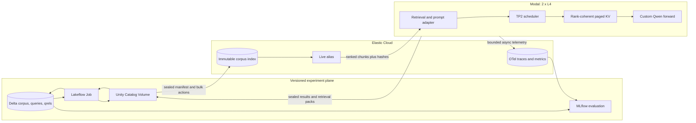

# ShardServe IR: Retrieval-Aware Tensor-Parallel Inference

**Technical project proposal — 7 September 2026**  
**Audience:** the builder, systems engineers, and technical reviewers  
**Decision:** how to turn ShardServe into a distinct AI systems project that uses Databricks and Elastic for necessary work

## Direct answer

Build **ShardServe IR**, a retrieval-aware, two-GPU inference runtime for investigating technical systems.

The visible application answers questions about source code, benchmark evidence, and inference failures with citations. The real engineering project underneath it asks a sharper question:

> Can a tensor-parallel inference server safely reuse KV blocks for repeated retrieved-document prefixes, reducing prefill work and time to first token while preserving exact generated tokens as the search index changes?

This gives each component a real job:

- **Elastic** performs low-latency lexical and semantic retrieval and stores searchable operational traces.
- **ShardServe on Modal** performs the custom TP2 model execution, owns admission and scheduling, and implements rank-coherent prefix reuse.
- **Databricks** owns the versioned corpus, immutable experiment inputs and results, replay, retrieval evaluation, generation evaluation, and MLflow comparison.

That is a stronger identity than “another RAG chatbot.” The product surface is useful, but the repository is judged by an inference-systems hypothesis, correctness invariants, fault tests, and reproducible GPU measurements.

## Why this direction fits the existing repository

ShardServe already has the hard base needed for this experiment: explicit TP1/TP2 execution, coordinator-planned iterations, NCCL collectives, one paged KV pool per rank, rank-failure supervision, a pinned Qwen model, a durable Databricks protocol, and two-L4 execution on Modal.

The current scheduler reserves the full prompt-plus-output capacity, admits FIFO, and has no prefix reuse. That leaves a clean engine problem: sharing a retrieved prefix changes allocation, ownership, scheduling, cancellation, eviction, and rank agreement. It is substantial systems work rather than an API integration.

The existing [`cloud-inference-from-scratch`](https://github.com/zeeshan8281/cloud-inference-from-scratch) project is already the better general single-GPU server. It includes demand paging, bounded prefix reuse, recompute preemption, ragged execution, CUDA graphs, quantization, Redis admission, a richer API, and vLLM comparisons. Rebuilding those features in ShardServe would create an inferior duplicate. ShardServe IR instead specializes in **retrieval provenance plus multi-rank cache coherence**.

| Existing inference project | ShardServe IR |
|---|---|
| General single-GPU Qwen serving | Retrieval-aware two-GPU serving experiment |
| Prefix reuse inside one physical KV pool | Exact prefix ownership mirrored across TP ranks |
| Request prefix identified by tokens | Prefix also bound to model, tokenizer, prompt format, concrete Elastic index, and ordered document hashes |
| Modal artifacts and direct benchmarks | Delta-versioned corpora, retrieval judgments, replay sets, and MLflow evaluation |
| API and serving performance are the product | Cross-system correctness, replayability, and retrieval/prefill co-design are the product |

The README should state the lineage plainly: ShardServe began from ideas and a small amount of math/kernel code adapted from the first project, while this branch investigates a different distributed systems problem.

## What the demo does

Use a small but technically meaningful corpus: both inference repositories, their documentation, committed benchmark summaries, failure evidence, and selected design notes. A reviewer can ask:

- “Why did request `run-42:req-17` miss its TTFT target?”
- “Which code path reserves KV blocks before admission?”
- “Find the evidence that TP2 ranks agree after a cancellation.”
- “Compare the prefix-cache hit rate before and after corpus revision 12.”

The response contains an answer, cited document IDs, the immutable corpus/index revision, the exact retrieval list, and the ShardServe run ID. A Kibana trace shows retrieval, queueing, prefill, TP collectives, decode, and durable commit. An MLflow run shows whether the answer was supported and whether the engine saved actual prefill work.

The best live sequence is:

1. Databricks seals a corpus revision and a judged query set.
2. A sync job bulk-indexes that revision into `shardserve-docs-v12`, verifies document counts and hashes, then atomically moves the `shardserve-docs-live` alias.
3. Several related questions retrieve overlapping leading documents from Elastic.
4. ShardServe runs with the prefix cache disabled, then enabled, on the same two L4 GPUs and request trace.
5. Kibana shows search latency, prefix hits, saved prefill tokens, KV pressure, TTFT, collective time, and any failures.
6. Databricks replays the same stored retrieval packs and checks exact output-token parity, retrieval quality, and one durable terminal result per request.

## How people use it

There should be one simple public experience and two progressively deeper technical experiences. People should not need Databricks, Elastic, or Modal credentials to try the hosted demo.

| User | Experience | What they see |
|---|---|---|
| Visitor or recruiter | Ask a technical question in a small hosted page | Answer, source citations, corpus revision, and a linkable run ID |
| Application developer | Call one HTTP endpoint or use a thin CLI | Structured answer, citations, timing, retrieval snapshot, and trace ID |
| Systems researcher | Replay a published workload against cache modes | Raw per-request results, correctness checks, and MLflow comparisons |
| Operator | Open Kibana and Databricks | Live request forensics in Elastic; durable experiments and evaluation in Databricks |

### Hosted demonstration

The public page needs only a repository selector, a question box, and an optional “show engine details” switch. Example questions should be built into the page so a reviewer can get a meaningful result immediately. The normal result shows:

- the generated answer;
- citations linked to exact source chunks;
- the indexed repository and corpus revision;
- total latency and time to first token;
- a stable run ID.

The details view adds the retrieved ranks, prompt-token count, reused-prefix tokens, TP degree, NCCL time, KV blocks, model revision, and links to a read-only Kibana trace and MLflow run when sharing permissions allow it.

The hosted service owns all infrastructure credentials. Give the browser a narrowly scoped application token or place the demo behind rate limiting; never expose Elastic, Databricks, Modal, or OTLP keys to frontend code. The public corpus is read-only, requests have strict token and time limits, and prompt/output text is excluded from operational telemetry by default.

### Developer API

Add one retrieval-aware endpoint while retaining the existing raw generation endpoints for engine testing:

```http
POST /answer
Authorization: Bearer $SHARDSERVE_API_TOKEN
Content-Type: application/json

{
  "request_id": "demo-001",
  "question": "Why does ShardServe reserve KV capacity before admission?",
  "repository": "shardserve",
  "max_new_tokens": 160,
  "include_debug": true
}
```

The response contract should be stable and compact:

```json
{
  "request_id": "demo-001",
  "answer": "...",
  "citations": [
    {
      "doc_id": "shardserve/scheduler.py:71-95",
      "source_url": "https://github.com/...",
      "content_sha256": "..."
    }
  ],
  "retrieval": {
    "index": "shardserve-docs-v12",
    "config_sha256": "...",
    "prompt_token_sha256": "..."
  },
  "engine": {
    "model_revision": "14d7620...",
    "tensor_parallel_size": 2,
    "input_tokens": 1240,
    "reused_prefix_tokens": 736,
    "ttft_ms": 182.4
  },
  "trace_id": "...",
  "terminal_status": "completed"
}
```

`include_debug` controls whether internal timing and cache fields are returned. Citations, corpus identity, status, and request identity are always present. The endpoint retrieves evidence first, freezes the retrieval pack, builds the canonical prompt, and then submits it through the existing scheduler. It does not create a second inference implementation.

A future `shardserve ask` command can be a thin standard-library HTTP client over this endpoint. It should print the answer and citations by default and emit the complete JSON with `--json`. There is no reason to create a separate Python SDK until users require one.

### Reproducible research use

A technical reviewer should be able to choose a published run manifest and reproduce one bounded comparison:

```text
same Delta query snapshot
same frozen Elastic retrieval packs
same model/tokenizer/source revisions
same two-L4 hardware class
    ├── prefix cache disabled
    ├── exact prefix cache enabled
    └── cache plus locality scheduling
```

The relay launches those modes, commits their results, and prints the MLflow run URLs. Large model files, indices, and raw traces remain remote. A contributor cloning the repository downloads only source code and compact fixtures unless they explicitly launch a GPU run.

### Using a different corpus

Self-hosters add documents to the governed Delta corpus table rather than uploading directly into the serving process. The publication job chunks and hashes the documents, builds a new immutable Elastic index, verifies it, and advances the alias. Existing retrieval packs remain replayable against their original index identity.

The first supported sources should be Git repositories and Markdown/JSON benchmark evidence. PDF, web crawling, access-control synchronization, and arbitrary connectors can wait until a real user needs them.

## Architecture



Databricks and Elastic stay outside the token loop. An Elastic or Databricks outage cannot interrupt an already admitted GPU iteration. Online requests use Elastic before admission; durable benchmark runs use the existing sealed-file protocol before and after GPU execution.

## The two data paths

### 1. Corpus publication

Databricks is the source of truth for documents and chunk boundaries. A corpus row contains `doc_id`, source path, text, content hash, chunker revision, update time, and tombstone state. Delta provides versioned snapshots and atomic commits; its documented default is snapshot isolation for reads and write-serializable isolation for writes ([Databricks ACID guarantees](https://docs.databricks.com/aws/en/lakehouse/acid)).

For each release:

1. Read one explicit Delta table version.
2. Write a sealed manifest to a Unity Catalog Volume.
3. Bulk-create documents in an immutable Elastic index whose name includes that Delta version.
4. Verify document count, manifest digest, and sampled content hashes.
5. Move the live alias in one alias update.
6. Record the concrete index name, index UUID, mapping hash, embedding/inference ID, and publication status back in Delta.

Start with Python’s official Elasticsearch bulk helper. Do not add a Spark connector until corpus size proves a single bounded bulk producer insufficient. Elastic aliases support atomic multi-action changes, which makes an immutable-index-plus-alias release practical ([Elastic aliases](https://www.elastic.co/docs/manage-data/data-store/aliases)).

### 2. Request execution and replay

For a request, Elastic returns the lexical and semantic branch ranks, final rank, score, document ID, and content hash. ShardServe forms a canonical prompt:

```text
[pinned system instruction]
[document 1 id + content]
[document 2 id + content]
...
[user question]
```

The runtime stores a compact **retrieval pack** before generation:

```json
{
  "request_id": "run-42:req-17",
  "index_name": "shardserve-docs-v12",
  "index_uuid": "...",
  "retrieval_config_hash": "...",
  "hits": [
    {"doc_id": "scheduler.py:71-95", "rank": 1, "content_sha256": "..."}
  ],
  "prompt_token_sha256": "..."
}
```

Replay consumes this pack directly, without rerunning approximate search. That separates two questions:

- Did retrieval return the right evidence?
- Given identical prompt tokens, did the engine remain correct and faster?

This distinction matters because approximate kNN results and a mutable live alias can otherwise confound an inference benchmark.

## Elastic’s technical role

### Hybrid retrieval

Use BM25 for exact identifiers, filenames, error messages, and symbols. Add a semantic branch for paraphrased questions. Elasticsearch supports approximate kNN on `dense_vector`, and Elastic recommends reciprocal rank fusion for combining lexical and vector rankings ([kNN search](https://www.elastic.co/docs/solutions/search/vector/knn), [hybrid search](https://www.elastic.co/docs/solutions/search/hybrid-search)).

The portable core should be:

- BM25 query;
- dense-vector kNN using a pinned embedding model;
- deterministic client-side RRF in the retrieval adapter;
- stored branch ranks and fused ranks.

Native RRF and packaged semantic models are useful during the Elastic Cloud trial, but some are paid-tier features. Client-side RRF is only a few deterministic lines and keeps the project runnable on the Basic license. The benchmark should report BM25, vector, hybrid, and optional reranker results separately instead of assuming hybrid is better.

Keep chunking in Databricks so corpus revisions are reproducible. If `semantic_text` is tested, disable automatic chunking for pre-chunked passages and pin the inference endpoint; current defaults can vary by deployment and version ([`semantic_text` configuration](https://www.elastic.co/docs/reference/elasticsearch/mapping-reference/semantic-text-setup-configuration)).

### Search evaluation

Databricks stores query judgments and drives sweeps, while Elasticsearch computes retrieval results. Elastic’s `_rank_eval` API supports metrics including precision, recall, MRR, DCG/NDCG, and ERR ([rank evaluation API](https://www.elastic.co/docs/reference/elasticsearch/rest-apis/search-rank-eval)). Store the raw response and retrieval configuration in Delta, then log aggregate comparisons in MLflow.

### Runtime forensics

Export manual OpenTelemetry spans and metrics from ShardServe to Elastic. Do not emit one span per generated token; use one decode span with events and aggregated measurements. Suggested spans are:

- `elastic.retrieve`
- `scheduler.queue`
- `model.prefill`
- `model.decode`
- `tp.collective`
- `result.seal`
- `delta.commit`

Elastic’s managed OTLP endpoint accepts traces, logs, and metrics; its turnkey LLM instrumentation targets selected providers, so ShardServe needs manual instrumentation ([Elastic OTel ingestion](https://www.elastic.co/docs/solutions/observability/get-started/quickstart-elastic-cloud-otel-endpoint), [LLM observability](https://www.elastic.co/docs/solutions/observability/get-started/opentelemetry/use-cases/llms)). Send telemetry asynchronously through a bounded queue, count dropped events, and also seal the complete compact event shard in the Unity Catalog run directory. Elastic is the searchable operational mirror; Delta remains the durable record.

### Optional native inference integration

After the direct runtime works, expose a non-streaming, authenticated ShardServe completion endpoint and register it through Elastic’s custom Inference API. The custom service is generally available from 8.19, supports `completion`, and allows request templates, secret headers, and JSON response parsing ([Elastic custom inference endpoint](https://www.elastic.co/docs/api/doc/elasticsearch/v8/operation/operation-inference-put-custom)). This creates a good final demo, but it should not control scheduling or replace ShardServe’s streaming API. Availability depends on the selected Elastic license.

## Databricks’ technical role

The current durable data plane should grow into an experiment and evaluation plane:

| Delta table | Purpose |
|---|---|
| `corpus_chunks` | Versioned, content-addressed source chunks |
| `index_publications` | Delta version to Elastic index mapping and verification |
| `evaluation_queries` | Question, split, expected evidence, optional answer rubric |
| `retrieval_runs` | Exact ranked hits and retrieval configuration |
| `generation_results` | Tokens, timings, cache statistics, status, attempt identity |
| `evaluation_results` | Retrieval, citation, answer, and systems scores |

Use `MERGE` with a deduplicated source for idempotent result publication. Do not claim exactly-once GPU execution: retries may execute more than once, while Delta publishes one authoritative result. Delta constraints such as primary keys are informational, so the commit code must continue enforcing identity ([Databricks `MERGE`](https://docs.databricks.com/aws/en/delta/merge), [Databricks ACID guarantees](https://docs.databricks.com/aws/en/lakehouse/acid)).

MLflow records model and tokenizer revisions, source digest, corpus/index revisions, TP degree, GPU identity, retrieval configuration, benchmark protocol, and summary metrics. MLflow 3 supports evaluation datasets, custom scorers, judges, traces, and version comparison; production monitoring is currently marked Beta ([Databricks evaluation and monitoring](https://docs.databricks.com/aws/en/mlflow3/genai/eval-monitor)). Use deterministic scorers first:

- cited IDs exist in the retrieved pack;
- every factual citation points to supporting text;
- exact output-token parity with cache disabled;
- answer key or required-fact coverage;
- no duplicate authoritative result;
- zero KV ownership after terminal paths.

An LLM judge can be an optional secondary measure. The project should remain evaluable without a paid judge endpoint.

## The new engine work

### 1. Retrieval-bound prefix identity

A reusable cache entry is valid only when all identity fields match:

```text
model revision
tokenizer revision
prompt-format revision
concrete Elastic index name and UUID
ordered document IDs and content hashes
exact block-aligned token IDs
```

The final digest is computed over the token blocks themselves. Index identity explains provenance; token identity proves cache safety. A live alias is never sufficient as a cache key.

### 2. Rank-coherent ownership

The coordinator owns the logical prefix table. Each cached prefix points to the same logical block IDs on both ranks, while each rank stores its own sharded K/V tensors in those locations. Admission, reference increments, request-suffix allocation, release, and eviction are broadcast as part of the iteration plan.

Required invariants:

- both ranks have the same logical block table and reference counts;
- a request can release only its private suffix and its references;
- a cached block is evicted only at reference count zero;
- cancellation, deadline, backpressure, and rank failure cannot leak ownership;
- a process-group restart discards the entire prefix cache;
- a periodic logical-state digest detects divergence and fails the group before another model step.

Start with block-aligned exact prefixes and LRU eviction. Partial final blocks are recomputed. Do not add a trie, host offload, or cross-replica cache until measurements require them.

### 3. Scheduler integration

Version one keeps FIFO admission and merely attaches the longest valid cached prefix. This proves correctness with the smallest scheduler change. Once traces show useful overlap, add a bounded locality window: among requests that arrived within a few milliseconds, prefer the request with the largest cached-token benefit, while enforcing oldest-wait and deadline limits.

This creates a real scheduling tradeoff: saved prefill work versus extra queueing. It must be measured at fixed arrival rates, not with an unlimited closed-loop benchmark.

### 4. Bounded cache capacity

Divide the current KV block pool into request-owned and prefix-owned capacity with one configurable prefix cap. Under pressure, evict unreferenced prefixes before rejecting a request. Record logical prompt tokens, executed prefill tokens, reusable tokens, evictions, and allocation failures. The cache is successful only if saved compute outweighs the capacity it removes from active requests.

## Experiment design

The first experiment is a cheap feasibility gate. Run retrieval over the intended query set and calculate:

- exact leading-document overlap;
- block-aligned shared prompt-token distribution;
- predicted reusable prefill tokens at several cache sizes;
- how often ranking or corpus changes invalidate a prefix.

If the workload has little exact leading-prefix reuse, stop the cache project before changing GPU code. Keep the useful Elastic retrieval, Databricks evaluation, and engine telemetry, and make the inference failure flight recorder the project’s core systems contribution.

If locality exists, use the same pinned model, two L4s, request trace, arrival timestamps, generation settings, and retrieval packs for all engine comparisons.

| Axis | Comparisons |
|---|---|
| Retrieval | BM25; vector; client-side hybrid; optional native RRF/reranker |
| Engine | cache off; exact prefix cache; cache plus bounded locality scheduling |
| Parallelism | TP1 correctness reference; TP2 target; optional vLLM TP2 reference |
| Workload | cold unique queries; repeated topic bursts; mixed topics; corpus alias change; KV pressure |
| Faults | cancellation; deadline; rank crash; Elastic timeout; duplicate result commit; partial bulk failure |

Run at least three paired repetitions in randomized order after equal warmup. Persist raw per-request records, not only averages.

### Release gates

1. **Retrieval:** publish Recall@k, MRR, and NDCG@10 on a held-out judged set; no unsupported “better search” claim.
2. **Generation:** cache-on and cache-off produce identical greedy output tokens for every acceptance request.
3. **Distributed state:** both ranks report the same logical ownership digest after admission, cancellation, eviction, and completion.
4. **Cleanup:** all terminal and injected-failure paths return to zero request-owned blocks with no negative reference counts.
5. **Performance:** on the repeated-topic workload, executed prefill tokens and p95 TTFT improve by a declared threshold; on the cold workload, p95 TTFT and goodput stay within a declared regression budget.
6. **Replay:** an old retrieval pack reproduces identical prompt tokens after the live alias advances.
7. **Durability:** retrying a completed attempt leaves one authoritative Delta result per request.
8. **Observability:** a trace joins retrieval, engine, and commit stages by `run_id` and `request_id`, and telemetry loss is visible.

Choose numeric performance thresholds only after a pilot establishes measurement noise. Publish a negative result if the cache does not win; the controlled experiment still demonstrates good systems work.

## Implementation sequence

### Phase 0 — feasibility before GPU changes

- Build the corpus and 50–100 judged technical questions.
- Publish one immutable Elastic index from one Delta version.
- Implement BM25 plus one semantic branch and deterministic client-side RRF.
- Store retrieval packs and measure exact prefix locality.
- Stop here if the expected cache benefit is negligible.

### Phase 1 — complete retrieval/evaluation loop

- Add the Delta tables above using the existing control-plane deployment.
- Run `_rank_eval` sweeps from the job or relay.
- Log configurations and aggregate metrics to MLflow.
- Add one end-to-end cited answer path through the current ShardServe API.

### Phase 2 — TP2 exact-prefix cache

- Extend `Blocks` with shared ownership and a prefix capacity cap.
- Broadcast prefix attach/release/evict operations in coordinator plans.
- Add rank-state digests and fail-fast disagreement checks.
- Prove exact token parity, reference safety, cancellation, eviction, and restart behavior.

### Phase 3 — retrieval-aware scheduling

- Record cache benefit for waiting requests.
- Add a small bounded locality window with starvation and deadline guards.
- Benchmark FIFO, cache-only, and locality scheduling at fixed arrival rates.

### Phase 4 — operational evidence

- Add manual OTel spans and bounded asynchronous export to Elastic.
- Save the same compact event shard in the existing Unity Catalog run directory.
- Build one Kibana dashboard for search latency, TTFT, prefill savings, KV pressure, NCCL time, failures, and telemetry drops.
- Run an instrumentation-on/off overhead comparison.

### Phase 5 — polished integration

- Register ShardServe as an Elastic custom completion endpoint if the trial/license supports it.
- Record a full demo with an index release, repeated-topic burst, cache hit, rank failure, durable replay, and MLflow comparison.
- Update the README only with measured results and links to compact evidence.

## Minimal file-level change plan

Keep the implementation small and reuse existing code:

- add `shardserve/retrieval.py` for Elastic queries, client-side RRF, and retrieval-pack validation;
- modify `shardserve/cache.py`, `scheduler.py`, and `runtime.py` for shared blocks and rank-coherent plans;
- extend the current API with one cited-answer route rather than adding a second web framework;
- extend the existing Databricks control-plane notebook and relay;
- add `deploy/elastic/bootstrap.py` for index templates, alias publication, and saved queries;
- add focused CPU tests for RRF, pack validation, ownership/refcounts, and plan replay, plus one GPU acceptance case for token parity.

Do not build a custom UI, Kafka pipeline, agent framework, vector database abstraction, plugin system, or local Elasticsearch cluster.

## Cost, authentication, and local disk

Use the existing Databricks CLI OAuth login for development. A production deployment would use a service principal with OAuth machine-to-machine authentication ([Databricks unified authentication](https://docs.databricks.com/aws/en/dev-tools/auth/unified-auth), [OAuth M2M](https://docs.databricks.com/aws/en/dev-tools/auth/oauth-m2m)). Store the Elastic URL/API key and OTLP key in Modal and Databricks secret storage, never in Git or generated artifacts.

Databricks Free Edition is suitable for small Delta, SQL, job, Volume, and MLflow work, but it is serverless-only, permits at most five concurrent job tasks, restricts outbound internet, and does not provide custom GPU serving or GPU batch inference. Keep Modal as the GPU executor and let the relay or Modal talk to Elastic ([Databricks Free Edition limitations](https://docs.databricks.com/aws/en/getting-started/free-edition-limitations)).

Use an Elastic Cloud Hosted trial for the demonstration. It keeps indices, semantic models, Kibana, and telemetry remote. The Cloud trial is time-limited, so the core must continue to work on Basic with BM25, `dense_vector`, client-side RRF, and ordinary search/observability features ([Elastic Cloud trial](https://www.elastic.co/cloud/activate-trial), [Elastic subscriptions](https://www.elastic.co/subscriptions/)).

Local storage remains small:

- model weights stay in the existing Modal Volume;
- corpus tables, manifests, raw results, and long traces stay in Databricks;
- search indices and dashboards stay in Elastic Cloud;
- the relay uses a temporary directory and deletes it;
- Git stores only code, small fixtures, compact JSON summaries, and documentation;
- no local Docker Elasticsearch, model cache, Parquet mirror, or raw profiler archive.

The current checkout is about 13 MB. A reasonable repository budget is to keep committed evidence below 25 MB and link large remote artifacts by run ID and checksum.

## Alternatives considered

| Direction | Technical depth | Databricks role | Elastic role | Decision |
|---|---:|---:|---:|---|
| Generic Elastic RAG assistant | Low | Dataset storage | Retrieval | Reject: common demo and weak engine contribution |
| TP1/TP2 adaptive topology controller | Very high | Train/evaluate policy | Live telemetry | Research later: first prove a workload where TP2 beats two TP1 replicas after switch cost |
| Learned collective/kernel autotuner | Very high | Experiment store and model | Forensics | Credible, but Elastic is secondary and the demo is harder to understand |
| Inference failure flight recorder | Medium | Durable evidence/replay | Excellent observability | Keep as fallback or supporting feature |
| Retrieval-aware TP2 prefix reuse | High | Corpus, replay, evaluation | Retrieval and forensics | **Recommended:** coherent use of all systems and visible engine work |

The topology controller is the strongest future research branch if a crossover exists. The initial gate would compare two independent TP1 workers with one TP2 group on the same two L4s. Do not build dynamic switching or request migration before that crossover is measured.

## Definition of done

The project is ready to present when a reviewer can:

1. clone a lightweight repository and run CPU/control checks without downloading weights;
2. inspect a Delta corpus version and its verified Elastic index publication;
3. issue a cited technical question through the custom TP2 engine;
4. inspect the exact retrieval pack and replay it after an index update;
5. compare BM25, vector, and hybrid retrieval in MLflow;
6. compare cache-off, cache-on, and locality scheduling with raw paired results;
7. see exact token parity and cross-rank KV ownership checks pass;
8. follow one request across Elastic retrieval, GPU phases, and Delta commit;
9. observe a rank failure or partial index failure handled without corrupting authoritative results;
10. understand in one minute why this project is different from the first inference repository.

## Material limitations

- Exact-prefix reuse may be rare when retrieved document order changes frequently. Phase 0 exists to measure this before GPU work.
- A 3B model on two PCIe L4s may not outperform one L4; the project claims distributed correctness and measured tradeoffs unless data proves a speedup.
- Approximate search can vary. Engine comparisons therefore replay stored retrieval packs.
- Prefix blocks consume capacity that could serve live requests. The benchmark must include cold traffic and KV pressure.
- Native RRF, ELSER, reranking, and custom inference integration can depend on Elastic tier and deployment. The Basic-compatible path is the required baseline.
- Databricks Free Edition has quotas, restricted networking, no SLA, and no custom GPU serving. It is the data/evaluation plane, not the online GPU runtime.
- MLflow production monitoring is Beta. Offline evaluation and stored traces remain the acceptance evidence.

## Sources and access notes

Research used first-party product documentation and the two repositories, accessed 7 September 2026. The most consequential sources are linked next to the claims they support:

- **Zeeshan Ahmed**, “Cloud Inference Engine Lab,” GitHub repository, current README and source: [cloud-inference-from-scratch](https://github.com/zeeshan8281/cloud-inference-from-scratch).
- **Databricks**, “What are ACID guarantees on Databricks?” updated 11 June 2026: [documentation](https://docs.databricks.com/aws/en/lakehouse/acid).
- **Databricks**, “Databricks Free Edition limitations,” updated 20 July 2026: [documentation](https://docs.databricks.com/aws/en/getting-started/free-edition-limitations).
- **Databricks**, “Evaluate and monitor agents,” current MLflow 3 documentation: [documentation](https://docs.databricks.com/aws/en/mlflow3/genai/eval-monitor).
- **Databricks**, “Use Delta Lake change data feed,” updated 4 September 2026: [documentation](https://docs.databricks.com/aws/en/tables/features/change-data-feed).
- **Elastic**, “Hybrid search,” current documentation: [documentation](https://www.elastic.co/docs/solutions/search/hybrid-search).
- **Elastic**, “k-nearest neighbor search,” current documentation: [documentation](https://www.elastic.co/docs/solutions/search/vector/knn).
- **Elastic**, “Create a custom inference endpoint,” GA, added in 8.19: [API documentation](https://www.elastic.co/docs/api/doc/elasticsearch/v8/operation/operation-inference-put-custom).
- **Elastic**, “Ranking evaluation,” current documentation: [documentation](https://www.elastic.co/docs/reference/elasticsearch/rest-apis/search-rank-eval).
- **Elastic**, “OpenTelemetry with Elastic,” current documentation: [documentation](https://www.elastic.co/docs/solutions/observability/get-started/quickstart-elastic-cloud-otel-endpoint).
